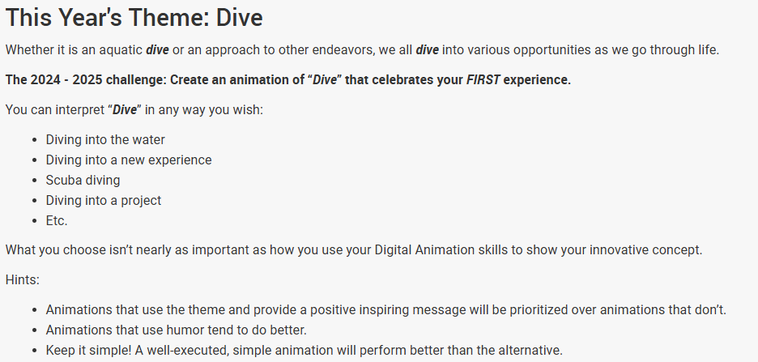
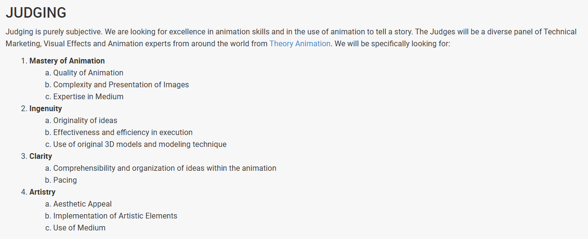

# DIVE_Animation_Repo_

This award, sponsored by AutomationDirect.com, celebrates the art of digital animation and its close relationship to STEAM (Science, Technology, Engineering, Art, and Mathematics).

**NEW FOR 2025:** There will be separate competitions for both FIRST Robotics Competition & FIRST Tech Challenge teams..

The Digital Animation Award is offered to help encourage students to cultivate skills in design and creation of animation including, but not limited to, storytelling, creativity, use of computer software, and an understanding of different techniques and forms of animation. This award is open to all FIRST Robotics Competition teams and FIRST Tech Challenge teams and is optional.

## About

### Theme:

### Judging:

## Animation Storyboard

  (animation storyboard here)

